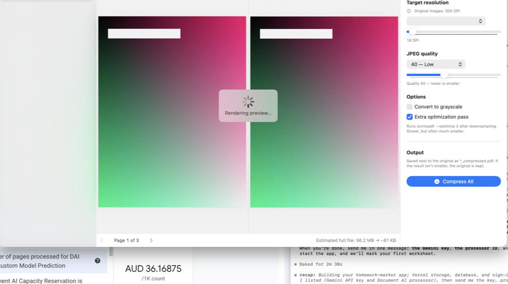

# PDF Compressor

A native macOS app that shrinks PDFs using Ghostscript downsampling plus an
optional `ocrmypdf --optimize` pass — the same pipeline as the original
Automator shell script, now with a live before/after preview.



## Features

- **Drag & drop** PDFs anywhere in the window (or ⌘O, or "Open With" from Finder — the app registers as a PDF viewer).
- **Live preview** — the current page is run through the real Ghostscript pipeline at your chosen settings, so you see the actual artifacts before committing. Updates as you drag the sliders (debounced). Two modes (switchable in the footer):
  - **Slider** (default) — one page with a draggable divider: original on the left, compressed on the right.
  - **Side by Side** — both versions next to each other.
- **Finder Quick Action** — right-click a PDF → Quick Actions → **Compress PDF** opens it straight in the app (installed by `install.sh`).
- **Whole-file size estimate** based on the previewed page's compression ratio.
- **Detected source DPI** per file (via `pdfimages -list`), shown in the sidebar and settings panel.
- **Target DPI** — the original script's presets (300 "Print quality" … 10 "Practically destroyed") plus a free slider (10–300).
- **JPEG quality** — presets (90…15) plus a free slider (5–95).
- **Grayscale conversion** option.
- **Extra optimization pass** (`ocrmypdf --optimize 3 --skip-text`, toggleable).
- **Batch queue** with per-file progress, results (`4.2 MB → 850 KB (−80%)`), and a completion notification.
- Output saved next to the original as `*_compressed.pdf` (uniqued, never overwrites). If the result isn't smaller, the original is kept — same as the script.

## Requirements

```sh
brew install ghostscript poppler ocrmypdf   # ocrmypdf is optional
```

macOS 14+, Apple Silicon (change `TARGET` in `build.sh` for Intel).

## Build & install

```sh
./build.sh      # builds dist/PDF Compressor.app
./install.sh    # copies it to /Applications + installs the Finder Quick Action
```

The Quick Action lives in `QuickAction/Compress PDF.workflow` and is copied to
`~/Library/Services`. To remove it: delete it there (and the app from
/Applications).

### Build notes

- `swift build` is broken in the current Command Line Tools install
  (missing `BuildServerProtocol.framework`), so `build.sh` invokes `swiftc`
  directly on `Sources/PDFCompressor/*.swift`.
- The macOS 27 SDK's SwiftUI requires a `SwiftUIMacros` compiler plugin that
  the CLT doesn't ship, so the build pins the **MacOSX15.5 SDK**
  (falls back to the default SDK if absent).
- The app icon is rendered programmatically by `scripts/makeicon.swift` into
  `Resources/AppIcon.icns` on first build.

## Layout

```
Sources/PDFCompressor/
  Engine.swift            # gs/ocrmypdf/pdfimages plumbing, preview + compress pipeline
  AppState.swift          # file queue, settings, debounced preview, batch runner
  Views.swift             # main window, sidebar, preview pane, settings panel
  PDFCompressorApp.swift  # @main, app delegate (Finder "Open With", dock drops)
Resources/Info.plist      # bundle metadata, PDF document type
QuickAction/              # "Compress PDF" Finder Quick Action (Automator service)
build.sh                  # compile + bundle + sign (ad-hoc)
install.sh                # install app + Quick Action
```
